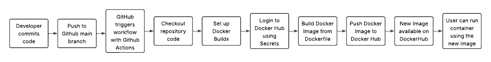

### Issue
I realized the due date was for Saturday, I had gotten it done on Sunday, but couldn't turn it in.

## Continuous Integration Project Overview

### What is the Goal of this Project
To automate the build and deployment of a containerized Angular application using Docker, GitHub Actions, and Docker Hub.

### What Tools are Used and Their Roles
- **Docker**: Containerization platform to run and package the Angular app
- **Angular CLI**: To build the frontend application
- **GitHub Actions**: CI pipeline to automate image building and pushing
- **DockerHub**: Hosting for the final Docker images

## Docker Setup

### How to Install Docker
Install Docker Desktop from https://www.docker.com/products/docker-desktop/

### Additional Dependencies
Requires [WSL2](https://learn.microsoft.com/en-us/windows/wsl/install) for Docker to run


### Confirm Docker is Installed
```bash
docker --version
docker run hello-world
```
If you see a greeting message from Docker, you're good to go

---

## Manually Setting up a Container to Test Angular App

### Run the Container
```bash
docker run -it -v /absolute/path/to/angular-site/angular-bird:/app -w /app -p 4200:4200 node:18-bullseye bash
```

### Explanation of Flags
- `-it`: Interactive terminal
- `-v`: Mounts your local Angular project into the container
- `-w`: Sets working directory inside the container
- `-p`: Maps container port 4200 to host port 4200
- `node:18-bullseye`: The base Node image

### Inside the Container (commands to run)
```bash
npm install -g @angular/cli http-server
npm install
ng build --configuration=production
http-server dist/wsu-hw-ng -p 4200
```

### Verifying the App is Running
- **Container Side**: You should see `http-server` logs showing it’s serving on port 4200
- **Host Side**: Open browser to `http://localhost:4200`

---

## Dockerfile & Building Images

### Dockerfile Summary
- Uses `node:18-bullseye` as base
- Sets working directory to `/app`
- Copies Angular code to image
- Installs Angular CLI and dependencies
- Builds production version of Angular app
- Runs app using `http-server`

### Build the Image
```bash
docker build -t angular-app .
```

### Run the Image
```bash
docker run -p 4200:4200 angular-app
```

### Verifying the App is Running
- **Container**: Should show `http-server` logs
- **Host**: Go to `http://localhost:4200`

---

## Working with DockerHub

### Create a Public Repo
1. Log in to [https://hub.docker.com](https://hub.docker.com)
2. Go to Repositories → Create Repository
3. Name it (`jervis-ceg3120`), make it **public**

### Create a Personal Access Token (PAT)
1. Go to Account Settings → Security → New Access Token
2. Set scope: **Read/Write**
3. Name it (`github-actions`)
4. Copy and store it securely

### Authenticate via CLI
```bash
docker login
# Use your DockerHub username
# Paste the PAT when prompted for password
```

### Push the Image
```bash
docker tag angular-app wsudjervis/jervis-ceg3120:latest
docker push wsudjervis/jervis-ceg3120:latest
```

### Link to DockerHub Repo
👉 [https://hub.docker.com/repository/docker/wsudjervis/wsudjervis-ceg3120](https://hub.docker.com/repository/docker/wsudjervis/wsudjervis-ceg3120/)

---

## Configuring GitHub Repository Secrets

### How to Create a PAT for Authentication
1. Log into Docker Hub
2. Go to Account Settings > Security > Access Tokens
3. Create a new token with **read/write** access

### How to Set Repository Secrets
1. Go to your GitHub repository
2. Click **Settings** > **Secrets and variables** > **Actions**
3. Click **New repository secret**
4. Add the following:
   - `DOCKER_USERNAME` = Your Docker Hub username
   - `DOCKER_TOKEN` = Your Docker Hub PAT

### Secrets Set for This Project
- `DOCKER_USERNAME`: Used in the workflow to identify your Docker Hub account
- `DOCKER_TOKEN`: Used for secure authentication with Docker Hub

---

## CI with GitHub Actions

### Summary of Workflow
- Triggered on push to the `main` branch
- Builds Docker image from your Dockerfile
- Logs into Docker Hub using secrets
- Pushes the image to Docker Hub

### Workflow File Location
[https://github.com/WSU-kduncan/ceg3120-cicd-DJervis04/blob/main/.github/workflows/docker-push.yml](https://github.com/WSU-kduncan/ceg3120-cicd-DJervis04/blob/main/.github/workflows/docker-push.yml)

## Testing & Validating

### Test the Workflow
- Push a small commit to `main` branch
- Go to GitHub > Actions > Check that the workflow ran successfully
- Check Docker Hub to see if a new image was pushed

### Test the Image from DockerHub
```bash
docker pull wsudjervis/jervis-ceg3120:latest
docker run -p 4200:4200 wsudjervis/jervis-ceg3120
```
Visit `http://localhost:4200` to confirm it's working

## Diagram


## Resources
- [Docker Official Docs](https://docs.docker.com/)
- [GitHub Actions Documentation](https://docs.github.com/en/actions)
- [DockerHub Docs](https://docs.docker.com/docker-hub/)
- [Course Notes](https://github.com/pattonsgirl/CEG3120/blob/main/CourseNotes/containers.md)

